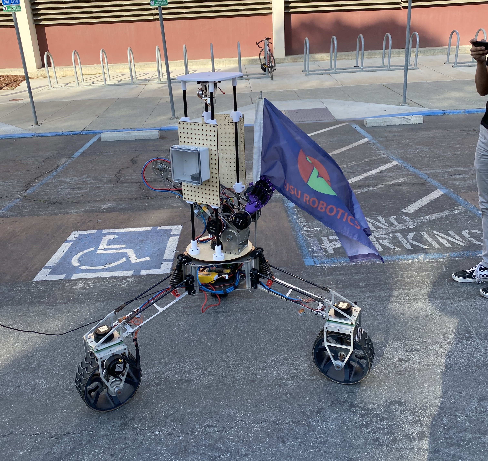

# SJSU Robotics - Control Systems 2022
Contains the control systems logic for the SJSU Robotics' 3-Wheeled Mars Rover

## Naming Conventions
**Files** - *descriptor*-*descriptor2(optional)*
examples: hand-modes.hpp, hand-router.hpp, command-lerper.hpp
**Variables** - *descriptor*_*descriptor2(optional)*
examples: rotunda_mpu, arm_argument, left_wrist
**Functions** - CamelCase 
examples: sjsu::LogInfo, arm.Initialize(), sjsu::arm::JointRouter()

## How to clone and create branch for submitting a pull request (PR).

1. Clone / Download the Repo  
   `git clone https://github.com/SJSURoboticsTeam/urc-control_systems-2022.git`
1. Change into the Repo's Directory  
   `cd urc-control_systems-2022/`
1. Create new branch from current branch (since this is new project it is master branch)  
   `git checkout -b *FInitial+LastName*-*Descriptor1*-*Descriptor2(optional)*`
1. Stage all the files you want to commit to git version control system. You can add multiple files at a time.  
   `git add name.cpp of.cpp files.cpp here.hpp`
1. Add a commit message describing what you changed.  
   `git commit -m 'example of a commit message'`
1. Push local git commits to github. Will push according to the branch you are currently on.  
   `git push`
1. Go to the Repo's GitHub website  
   `https://github.com/SJSURoboticsTeam/urc-control_systems-2022`
1. Go to the Pull Request tab and click 'New Pull Request' button.
   `https://github.com/SJSURoboticsTeam/urc-control_systems-2022/pulls`
1. Select your branch that you want to make a pull request with using the 'compare' drop down list.
1. Click 'Create Pull Request'
1. Within the pull request description make sure to link the Pull Request to a GitHub Issue found within the SJSURoboticsTeam/urc-central-2022 repo. Then add the following 'Resolves SJSURoboticsTeam/urc-central-2022/issues/#'  
   Example: `Resolves SJSURoboticsTeam/urc-central-2022/issues/100`

### Helpful Git Commands

`git status` - Shows all the files you have changed and have not yet committed.  
`git branch` - Shows the recent branches you've used and your current branch.  
`git pull origin/master` - Used for merging code with master when there are code conflicts. Need to be on development branch to use.

## Submitting a PR and Issue Management
## Important Links
- [Documentation](https://docs.google.com/presentation/d/17clPo-6g9CDImaTh3-akEh0AcbR9gbY4OoO5jGr4u0E/edit#slide=id.g67d1ef67815700a3_12)  
- [Testing Document](https://docs.google.com/document/d/1GoI3ypr8xW_N2GrNbO3eNoYoz85498nix4rTv1WexoA/edit?usp=sharing)  
- [Required Embedded Framework](https://github.com/SJSU-Dev2/SJSU-Dev2.git)  

 
